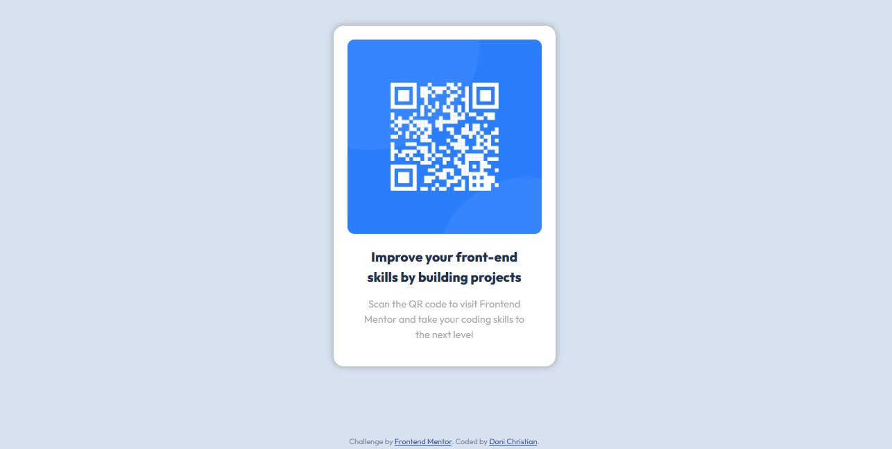
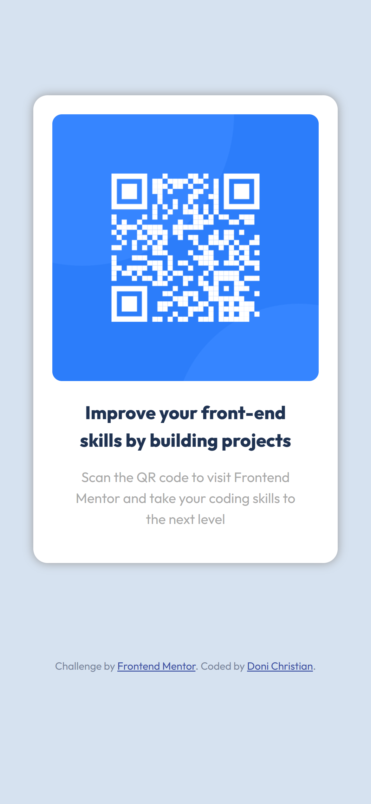

# Frontend Mentor - QR code component solution

This is a solution to the [QR code component challenge on Frontend Mentor](https://www.frontendmentor.io/challenges/qr-code-component-iux_sIO_H). Frontend Mentor challenges help you improve your coding skills by building realistic projects. 

## Table of contents

- [Overview](#overview)
  - [Screenshot](#screenshot)
  - [Links](#links)
- [My process](#my-process)
  - [Built with](#built-with)
  - [What I learned](#what-i-learned)
  - [Continued development](#continued-development)
  - [Useful resources](#useful-resources)
- [Author](#author)
- [Acknowledgments](#acknowledgments)

**Note: Delete this note and update the table of contents based on what sections you keep.**

## Overview

### Screenshot

 Desktop


Mobile

### Links

- Solution URL: [GitHub Repo](https://github.com/donichristian/qrCode-frontend-mentor)
- Live Site URL: [GitHub Pages](https://donichristian.github.io/qrCode-frontend-mentor/)

## My process

### Built with

- HTML
- CSS

### What I learned

During the process of working on this project, I learned several key concepts and techniques in CSS. Here are some of the learnings:

- Use of CSS Variables
  
  I gained a deeper understanding of how to define and utilize CSS variables to maintain consistent color schemes and other values throughout the stylesheet. For example:

  ```css
  :root {
      --white : hsl(0, 0%, 100%);
      --light-gray :hsl(212, 45%, 89%);
      --grayish-blue : hsl(220, 15%, 55%);
      --dark-blue : hsl(218, 44%, 22%);
  }
  ```

- Responsive Design with Media Queries
  
  I learned how to use media queries to implement responsive design, ensuring that the styles adapt to different screen sizes. For instance:

  ```css
  @media only screen and (max-width: 375px) {
      .card {
          width: 90%;
          margin: 50px auto;
          height: auto;
      }
  }
  ```

### Continued development

In future projects, I aim to further develop my skills in utilizing React and Next.js for building dynamic and performant web applications. Additionally, I plan to explore the usage of tailwind or bootstrap for efficient and responsive UI development. These tools will allow me to streamline the development process and create modern, responsive interfaces with ease. By focusing on these technologies, I aim to refine and perfect my proficiency in building robust and user-friendly web applications.

### Useful resources

- [MDN](https://developer.mozilla.org/) - MDN provided comprehensive and reliable documentation on HTML, CSS, and JavaScript, which was instrumental in understanding and implementing various CSS concepts.
- [W3Schools](https://www.w3schools.com/) - W3Schools offered practical examples and tutorials for CSS, which proved to be valuable in learning and applying responsive design techniques.


## Author

- Website - [Doni Christian](https://donichristian.vercel.app)
- Frontend Mentor - [@donichristian](https://www.frontendmentor.io/profile/donichristian)
- GitHub - [dn_christian](https://github.com/donichristian)

## Acknowledgments

I would like to express my gratitude to the following individuals and communities for their valuable contributions to my learning and development:
- The open-source community for creating and maintaining the technologies and tools that have been essential in this project.
- Online forums and communities such as Stack Overflow, where I found helpful insights and solutions to various CSS and web development challenges.

Their contributions have played a significant role in shaping my skills and understanding of web development.
